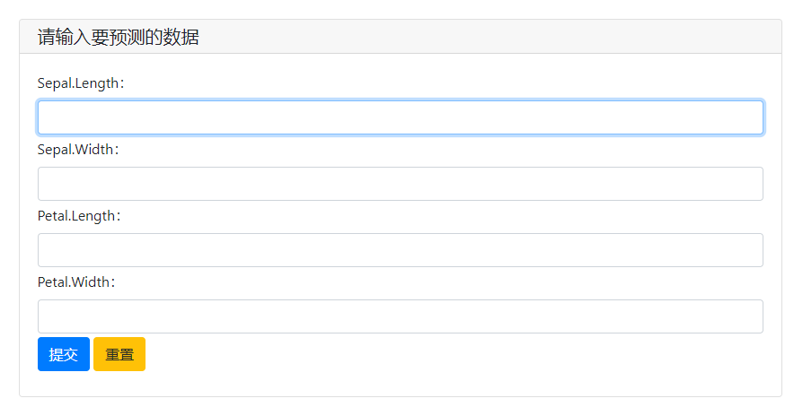

# 部署AI应用

## 1.准备工作

所谓准备工作就是先训练好一个效果不错的模型。

## 2.借助OpenCV识别摄像头画面

1）代码编写

```python
import cv2
from time import sleep
cap = cv2.VideoCapture(0)
print("一秒钟后开始拍照......")
sleep(1)
ret, frame = cap.read()
cv2.imshow("my_hand.jpg", frame)
cv2.waitKey(1000) # 显示1秒（这里单位是毫秒）
cv2.destroyAllWindows()
cv2.imwrite("my_hand.jpg", frame)
print("成功保存 my_hand.jpg")
cap.release()
```

2）运行效果


## 3.借助PyWebIO部署Web应用

1）编写代码

```python
from base import *
from MMEdu import MMBase
import numpy as np
from pywebio.input import input, FLOAT,input_group
from pywebio.output import put_text

# 鸢尾花的分类
flower = ['iris-setosa','iris-versicolor','iris-virginica']

# 声明模型
model = MMBase()
# 导入模型
model.load('./checkpoints/mmbase_net.pkl')
info=input_group('请输入要预测的数据', [
    input('Sepal.Length：', name='x1', type=FLOAT),
    input('Sepal.Width：', name='x2', type=FLOAT),
    input('Petal.Length：', name='x3', type=FLOAT),
    input('Petal.Width：', name='x4', type=FLOAT)
])
print(info)
x = list(info.values())
put_text('你输入的数据是：%s' % (x))
model.inference([x])
r=model.print_result()
put_text('模型预测的结果是：' + flower[r[0]['预测值']])
print('模型预测的结果是：' +flower[r[0]['预测值']])
```

2）运行效果



## 4.连接开源硬件开发智能作品

1）